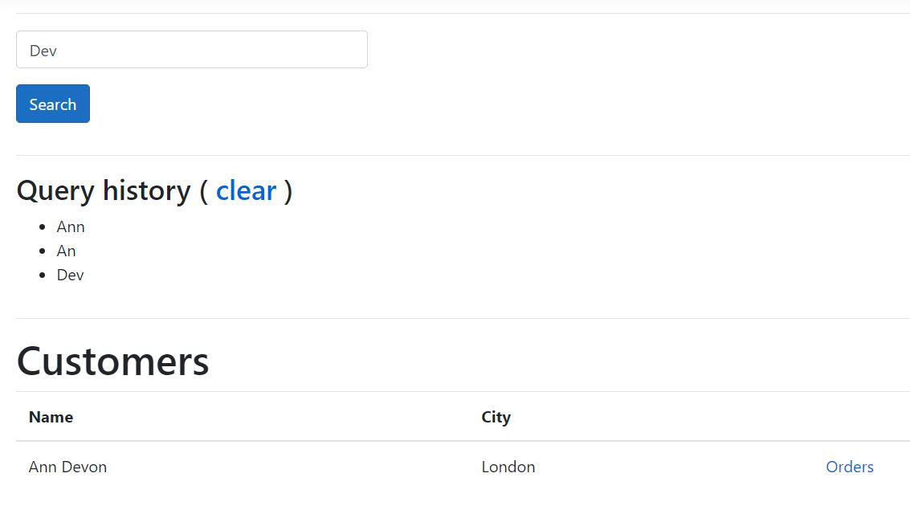
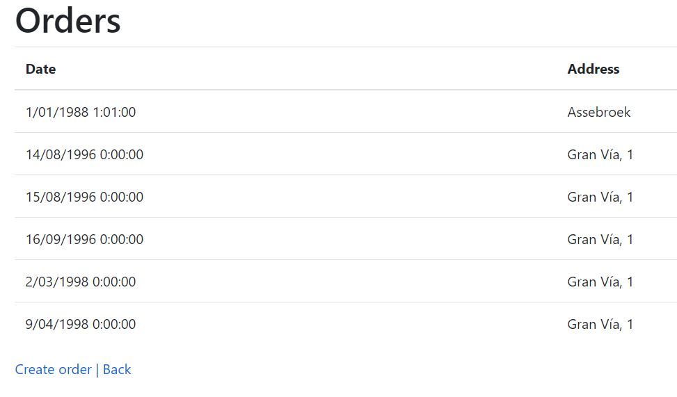
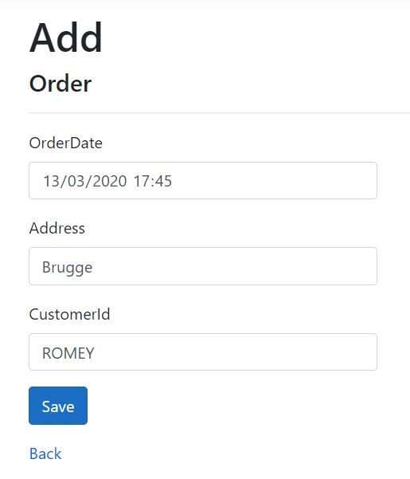

# Northwind app - MVC - Part II
This MVC application shows the basic of MVC in dotnet core.
  - Focus
    - **ViewModels**: Specific models for a view.
    - **Tag helpers**: Custom dotnet core html attributes.
    - **Forms**: Submitting forms in dotnet core mvc.
    - **Sessions**: Store temporally data.

# Purpose
Create a very basic MVC application with some submission form.

# Hints
- Please watch video and slides.
- Checkout the corresponding topic repo and try to understand the code.
- See screenshots at the bottom.

# Requirements
- Any communication between controller and view or vice versa happens through ViewModels.
- By default the application shows all the customers.
- A search field is available at the top.
  - This allow searching Customers by name (contains).
  - The search query (search value) is stored in the session state.
  - A list of previous search queries is shown.
  - Clicking a clear link in the search form, removes all previous queries.
- Clicking on the orders link of any customers shows the orders for that customer.
- The orders view contain a create order link.
- Clicking the create order link show a new CreateOrder view.
- A new order is created by providing the:
  - OrderDate
  - ShippingAddress
  - CustomerId

# Build the excercise
## Please execute in order!
  - Remove the packages from the csproj file.
  - Add the necessary entity packages (see cheat sheet)
  - Remove the **obj** folder if you have one.
  - Build the solution with **dotnet build**
  - Remove any previous models in Library/Models
  - Scaffold the models with the **force** and **no build** flag
    - **Change the connection** string of scaffold command.
    -   ```> dotnet ef dbcontext scaffold "Data Source=639GTQ2\SQLEXPRESS;Initial Catalog=Northwind;Integrated Security=True;" Microsoft.EntityFrameworkCore.SqlServer --output-dir Library/Models -f --no-build```
  - Use the proper NortwindContext object in the service classes.
  - Execute with dotnet run
  - surf to https://localhost:5001

# Screenshots
- **Customers**



- **Orders belonging to a customer.**
 


- **Creating an order for a specific customer.**

